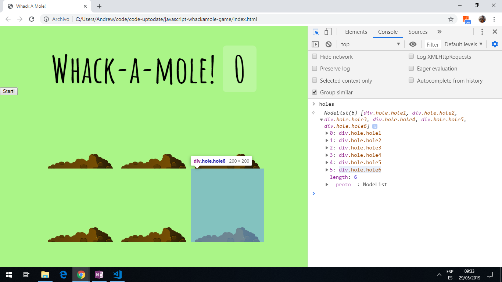

# Javascript Whackamole Game

Creates famous whackamole game using javascript. Final tutorial 30 of Wes Bos Javascript30 Youtube series.

**\* Note: to open web links in a new window use: _ctrl+click on link_**

## Table of contents

1. [General info](#general-info)
2. [Screenshots](#screenshots)
3. [Technologies](#technologies)
4. [Setup](#setup)
5. [Features](#features)
6. [Status](#status)
7. [Inspiration](#inspiration)
8. [Contact](#contact)

## General info

* Uses event listeners, timout functions etc. to keep score of the number of times a mole is clicked on.

## Screenshots

.

## Technologies

[Javascript v1.9 ECMA-262 ECMAScript 2018](http://www.ecma-international.org/publications/standards/Ecma-262.htm)

## Setup

* Open `index.html` in browser.

## Code Examples

* function to hit mole and remove up class if hit so mole stays hidden.

```javascript
// mouseclick event isTrusted means it is a real click.
// increment score and show on scoreboard using textContent
function bonk(e) {
 if(!e.isTrusted) return;
  score++;
  this.classList.remove('up');
  scoreBoard.textContent = score;
}

```

## Features

* The `time` variable in the peep function can be adjusted to make the game more difficult.
* The `background-size` css variable in the .mole class can be reduced (eg from 60% to 40% to make the game more difficult.

## Status & To-Do List

* Status: Working code.
* To-Do: Nothing.

## Inspiration

* [Wes Bos Youtube Javascript30 tutorial 30](https://www.youtube.com/watch?v=toNFfAaWghU&list=PLu8EoSxDXHP6CGK4YVJhL_VWetA865GOH&index=30)

## Contact

Repo created by [ABateman](https://www.andrewbateman.org) - feel free to contact me!
